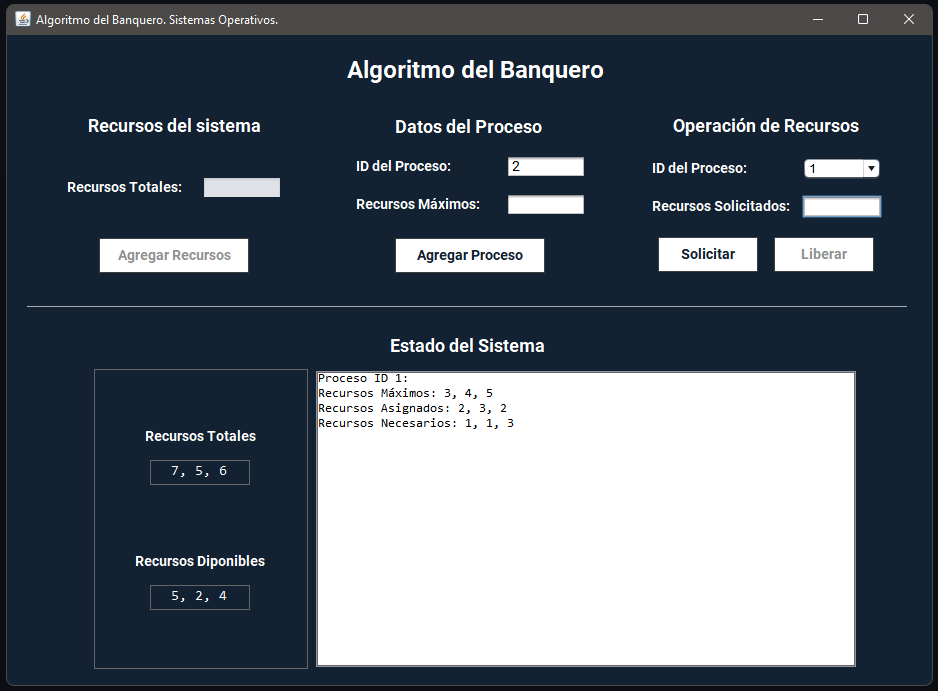

<div align="center">

# ⚙️ BankerSim

### Interactive Banker's Algorithm simulator for deadlock avoidance

A Java desktop application that simulates **resource allocation and process management** using the **Banker's Algorithm**, helping visualize safe states and avoid deadlocks in operating systems.

<br>


</div>

---

## 📌 About the Project

**BankerSim** is a Java desktop application developed as part of the **Operating Systems** course at Universidad Estatal a Distancia (UNED), during the second academic term of 2024.

The application simulates the **Banker's Algorithm**, a resource-allocation strategy used to determine whether a system can safely grant resources without entering a deadlock state.

The project provides an interactive graphical interface to visualize processes, available resources, allocations, and system states.

---

## ✨ Features

* Simulates the **Banker's Algorithm**.
* Evaluates whether the system is in a safe or unsafe state.
* Manages processes and system resources.
* Uses matrices and vectors for resource allocation.
* Displays current process states and assigned resources.
* Provides a graphical interface for easier visualization.

<div align="center">



</div>

---

## 🧠 Concepts Applied

This project applies core operating systems and programming concepts such as:

* Deadlock avoidance.
* Resource allocation.
* Safe and unsafe system states.
* Process management.
* Matrices and vectors.
* Algorithm implementation.
* Object-Oriented Programming.
* Graphical User Interfaces.

---

## 🛠️ Tech Stack

| Area      | Technology         |
| --------- | ------------------ |
| Language  | Java               |
| GUI       | Java Swing         |
| IDE       | Apache NetBeans    |
| Algorithm | Banker's Algorithm |

---

## 🎥 Demo

A complete demonstration of the simulator is available in the repository:

▶️ [View demo video](Demostración/Demo.mp4)

---

## 🚀 Run Locally

### 1. Clone the repository

```bash
git clone https://github.com/KendallCal/BankerSim.git
```

### 2. Open the project

Open the project using **Apache NetBeans**.

### 3. Build and run

Compile and execute the application.

### 4. Run a simulation

Enter process and resource data to analyze the system state and observe the Banker's Algorithm in action.

---

## 🎓 Academic Context

This project was developed for the **Operating Systems** course at Universidad Estatal a Distancia de Costa Rica.

It provided practical experience implementing concepts related to:

**operating systems · resource allocation · deadlock avoidance · algorithms · process management**

---

<div align="center">

### 👨‍💻 Kendall Calderón

[](https://github.com/KendallCal)
[](https://www.linkedin.com/in/kendallcal/)
[](https://www.kendallc.dev/)

</div>
